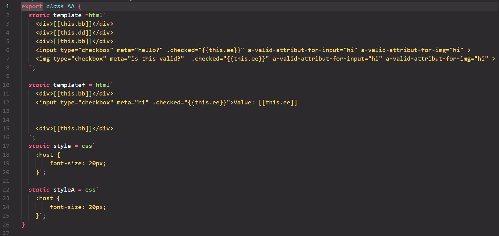
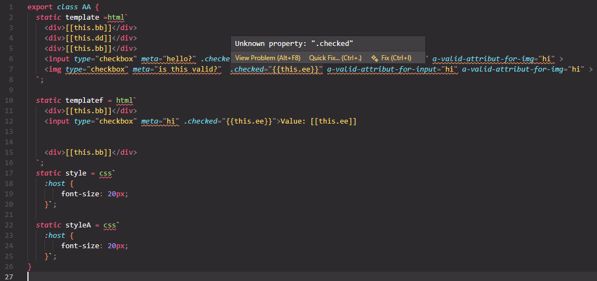

# Lit-HTML & Styled Components Extension

A VS Code extension that provides syntax highlighting and diagnostic features for lit-html templates, styled-components and css-templates in JavaScript/TypeScript projects.
This project builds on the [Base-Custom-Components](https://github.com/node-projects/base-custom-webcomponent/) project.

## Features

### Syntax Highlighting

The extension provides comprehensive syntax highlighting for:

- **lit-html Templates**: HTML syntax within template strings
- **CSS in lit-html**: CSS blocks in `<style>` tags within lit-html templates
- **Styled Components**: CSS syntax in styled-components for JavaScript/TypeScript

### Supported File Types

Syntax highlighting is activated for the following file types:
-JavaScript (`.js`, `.jsx`)
-TypeScript (`.ts`, `.tsx`)
-HTML (`.html`)

### Template-Extraction

The extension automatically analyzes:
-HTML template literals in JavaScript/TypeScript
-CSS template literals in styled-components

```typescript
static templatef = html`
    <div>[[this.bb]]</div> 
    <input type="checkbox" .checked="{{this.ee}}">Value: [[this.ee]]
    <div>[[this.bb]]</div>
  `;
static style = css`
    :host {
        font-size: 20px;
}`
```

### before activation



### After activation



- In this case, i declared ```.checked``` as a valid attribute only for ```input``` tag

- I also declared ```a-valid-attribut-for-input``` attribute only valid for ```input``` tag and for comparison i also declared ```a-valid-attribut-for-img``` attribute only valid for ```img```

## Installation

### Prerequisites

- Visual Studio Code Version 1.108.0 or higher
- Node.js and npm for development

### From Source code

1. Clone or download the repository
2. Install dependencies

    ```bash
    npm install
    npm run compile
    ```

3. In VS Code: Press ```F5``` to start a new Extension Development Host instance

### Usage

### Development

```Text
├── src/
│   ├── [extension.ts](http://_vscodecontentref_/0)             #Main entry point of the extension 
│   ├── class/                    # Validator-objects
│   ├── document/                 # Syntax-highlighting-logic
│   ├── utils/                    # Help components
|   ├── interface/                # Required interfaces
|   ├── images/                   # Images for README
```

### Dependencies

Important Dependencies

```Text
parse5: HTML5-compliant parser
lit-analyzer: Analysis tools for lit-html
vscode-html-languageservice: HTML language services
vscode-css-languageservice: CSS language services
vscode: Main accesspoint to the file & diagnostic
typescript: Typescript types
```

### Technical Details

#### The Extension Uses

```Text
Grammar Injection: Injects HTML/CSS syntax into JavaScript/TypeScript
Embedded Languages: Supports nested languages (HTML, CSS, SVG in JS/TS)
Diagnostic Collection: Collects and displays errors in templates
AST-Parsing: Analyzes template strings using Abstract Syntax Trees
```

Known Limitations
The extension is under active development

## Project Structure

### 📁 Interfaces

Contains custom type definitions and interfaces for type safety and structure clarity.

### 📁 Utils

Helper functions that provide core functionality:

- `createPosition.ts` - Creates global document offset positions.

- `createVscodeDiagnostic.ts` - Creates a vscode diagnostic.

- `extractHtmlTemplateBlock.ts` - Extracts single html line for `extractHtmlTagWithAttr.ts`

  ```html
  <input type="checkbox" .checked="{{this.ee}}">
  ```

- `extractHtmlTagWithAttr.ts` - Extracts a whole tag with its attributes for createTagData.

  ```Text
  input
  ├──Attr
  | ├── type
  | ├── .checked
  ├──pos
    ├── startoff
    ├── endoff
  ```

- `createTagData.ts` - Creates a tag with its attributes and positions.

- `internalPrinter.ts` - Helper for debugging.

- `extractHtmlCssTemplateBlock.ts & extractHtmlCssTemplateBlock.ts` - Extracts a whole tagged templateblock

  ```typescript
  static templatef = html`
      <div>[[this.bb]]</div> 
      <input type="checkbox" .checked="{{this.ee}}">Value: [[this.ee]]
      <div>[[this.bb]]</div>
    `;
  static style = css`
      :host {
          font-size: 20px;
  }`
  ```

### 📁 Document

Contains the logic for finding and processing tagged template literals.

### 📁 Class

Core validation and parsing classes:

- `HtmlValidator` - Logic for html syntax

- `CssValidator` - Logic for html syntax

- `CustomElement` - The central class of the project that handles custom element processing and validation. To add custom attributes for a specific tag, please add it here in the right place in the hierarchie.

## Add Custom Elements

- `To add a custom elements:`

- Search `customtags` or `Cntr + , then search customtags` then add an element with the following structure

`Valid example`

```Text
"html-css-template-validator.customTags": [
        {
            "name": "input",
            "description": "demo",
            "attributes": [
                {"name": ".checked", "description": "demo"},
                {"name": "a-valid-attribut-for-input", "description": "demo2"}
        ] //Make sure to add all Attributes to the Tag and do not add single Attribute to single Tag.
          // for each Tag is only one declaration valid do not create more than one
        },

```

`Invalid example`

```Text
"html-css-template-validator.customTags": [
        {
            "name": "input",
            "description": "demo",
            "attributes": [
                {"name": ".checked", "description": "demo"}
        ]
        },
        {
            "name": "input",
            "description": "demo",
            "attributes": [
                {"name": "a-valid-attribut-for-input", "description": "demo2"}
        ]
        },

```

##### Author

Developed by Emmanuel Youssef
